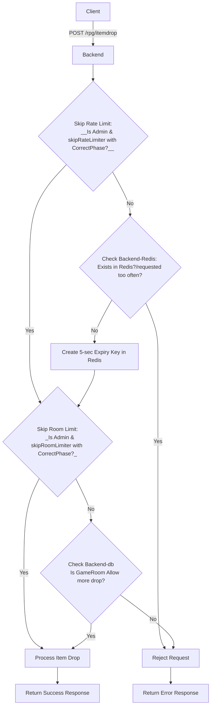

# APRG only endpoints
## /api/v99/rpg/
### for backend determine drop

```mermaid
graph TD;
    A[Client] -->|POST /rpg/itemdrop| B[Backend];
    
    B -->C{Skip Rate Limit:
      __Is Admin & skipRateLimiter with CorrectPhase?__};
    C -->|Yes| CA
    C -->|No| E{Check Backend-Redis: Exists in Redis?/requested too often?};
    E -->|Yes| G[Reject Request];
    E -->|No| H[Create 5-sec Expiry Key in Redis];

    CA{Skip Room Limit:
    _Is Admin & skipRoomLimiter with CorrectPhase?_};
    CA -->|Yes| F
    CA -->|No| DA{Check Backend-db
      Is GameRoom Allow more drop?};
    DA -->|Yes| F
    DA -->|No| G;

    H --> CA

    F[Process Item Drop];
    F --> I[Return Success Response];
    G --> J[Return Error Response];
```
