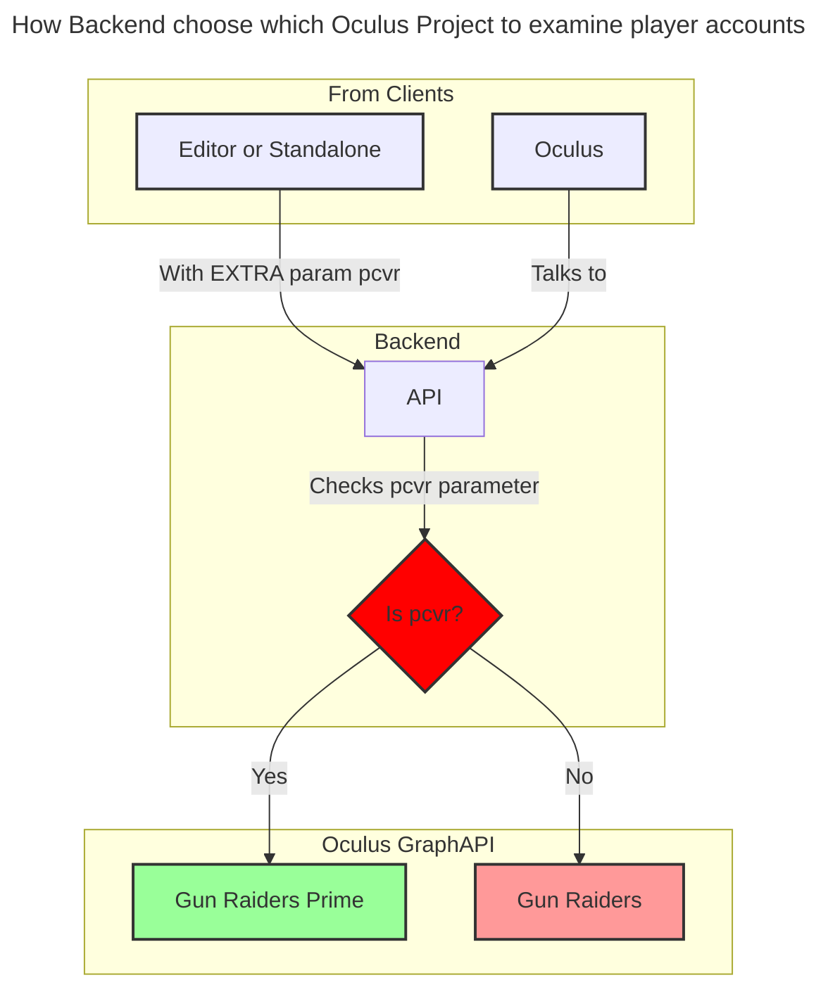

### Oculus 3rd Party API Usage

```mermaid
---
title: How Backend choose which Oculus Project to examine player accounts
---
flowchart TD
    subgraph Group1 [From Clients]
      A[Editor or Standalone]
      B[Oculus] 
    end

    A -->|With EXTRA param pcvr| API
    B-->|Talks to| API

    subgraph Group2 [Backend]
      API -->|Checks pcvr parameter| C{Is pcvr?}
    end

    subgraph Group3 [Oculus GraphAPI]
      C -->|Yes| D[Gun Raiders Prime]
      C -->|No| E[Gun Raiders]
    end      

    %% Style adjustments for clarity
    style A fill:#9f,stroke:#333,stroke-width:2px;
    style B fill:#9f,stroke:#333,stroke-width:2px;
    style C fill:#ff0000,stroke:#333,stroke-width:2px;
    style D fill:#99ff99,stroke:#333,stroke-width:2px;
    style E fill:#ff9999,stroke:#333,stroke-width:2px;
```
